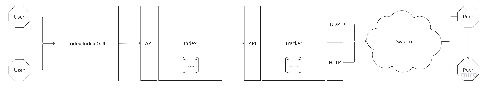

# Torrust Index

[![container_wf_b]][container_wf] [![coverage_wf_b]][coverage_wf] [![deployment_wf_b]][deployment_wf] [![testing_wf_b]][testing_wf]

__Torrust Index__, is a library for [BitTorrent][bittorrent] Files. Written in [Rust Language][rust] with the [axum] web framework. ___This index aims to be respectful to established standards, (both [formal][BEP 00] and [otherwise][torrent_source_felid]).___

> This is a [Torrust][torrust] project and is in active development. It is community supported as well as sponsored by [Nautilus Cyberneering][nautilus].

## About
The core purpose of a [BitTorrent][bittorrent] Index is to maintain a database that connects torrent files with useful metadata. Allowing a community of users to keep track their torrents in a well organized and informative manner.

The __Torrust Index__ serves a [high-level api][api] for our [Torrust Index GUI][gui] client. It also connects to the [management api][api_tracker] of our [Torrust Tracker][tracker], to provide statistic and whitelisting functionally.



## Key Features
**
- [x] High Quality and Modern Rust Codebase.
- [x] [Documentation][docs] Generated from Code Comments.
- [x] [Comprehensive Suit][coverage] of Unit and Functional Tests.
- [x] Good Performance in Busy Conditions.
- [x] Native `IPv4` and `IPv6` support.
- [x] Persistent `SQLite3` or `MySQL` Databases.

## Getting Started

### Upgrading
If you are using `Version 1` of `torrust-tracker-backend`, please view our [upgrading guide][upgrade.md].

### Container Version

The Torrust Index is [deployed to DockerHub][dockerhub], you can run a demo immediately with the following commands:

#### Docker:

```sh
docker run -it torrust/index:develop
```
> Please read our [container guide][containers.md] for more information.

#### Podman:

```sh
podman run -it torrust/index:develop
```
> Please read our [container guide][containers.md] for more information.

### Development Version

- Please assure you have the ___[latest stable (or nightly) version of rust][rust]___.
- Please assure that you computer has enough ram. ___Recommended 16GB.___

#### Checkout, Test and Run:

```sh
# Checkout repository into a new folder:
git clone https://github.com/torrust/torrust-index.git

# Change into directory and create a empty database file:
cd torrust-index
mkdir -p ./storage/index/lib/database/
touch ./storage/index/lib/database/sqlite3.db

# Check all tests in application:
cargo test --tests --benches --examples --workspace --all-targets --all-features

# Run the index:
cargo run
```
#### Customization:

```sh
# Copy the default configuration into the standard location:
mkdir -p ./storage/index/etc/
cp ./share/default/config/index.development.sqlite3.toml ./storage/index/etc/index.toml

# Customize the index configuration (for example):
vim ./storage/index/etc/index.toml

# Run the index with the updated configuration:
TORRUST_INDEX_PATH_CONFIG="./storage/index/etc/index.toml" cargo run
```

_Optionally, you may choose to supply the entire configuration as an environmental variable:_

```sh
# Use a configuration supplied on an environmental variable:
TORRUST_INDEX_CONFIG=$(cat "./storage/index/etc/index.toml") cargo run
```

_For deployment you __should__ override the `tracker_api_token` by using an environmental variable:_

```sh
# Please use the secret that you generated for the torrust-tracker configuration.
# Override secret in configuration using an environmental variable
TORRUST_INDEX_CONFIG=$(cat "./storage/index/etc/index.toml") \
  TORRUST_INDEX_TRACKER_API_TOKEN=$(cat "./storage/tracker/lib/tracker_api_admin_token.secret") \
  cargo run
```

> Please view our [crate documentation][docs] for more detailed instructions.

### Services
The following services are provided by the default configuration:

- API
  - `http://127.0.0.1:3001/`.

## Documentation

- [API (Version 1)][api]

## Contributing
We are happy to support and welcome new people to our project. Please consider our [contributor guide][guide.md].</br>
This is an open-source community supported project. We welcome contributions from the community!

__How can you contribute?__

- Bug reports and feature requests.
- Code contributions. You can start by looking at the issues labeled "[good first issues]".
- Documentation improvements. Check the [documentation][docs] and [API documentation][api] for typos, errors, or missing information.
- Participation in the community. You can help by answering questions in the [discussions].

## License

**Copyright (c) 2023 The Torrust Developers.**

This program is free software: you can redistribute it and/or modify it under the terms of the [GNU Affero General Public License][AGPL_3_0] as published by the [Free Software Foundation][FSF], version 3.

This program is distributed in the hope that it will be useful, but WITHOUT ANY WARRANTY; without even the implied warranty of MERCHANTABILITY or FITNESS FOR A PARTICULAR PURPOSE. See the [GNU Affero General Public License][AGPL_3_0] for more details.

You should have received a copy of the *GNU Affero General Public License* along with this program. If not, see <https://www.gnu.org/licenses/>.

Some files include explicit copyright notices and/or license notices.

### Legacy Exception

For prosperity, versions of Torrust Tracker that are older than five years are automatically granted the [MIT-0][MIT_0] license in addition to the existing [AGPL-3.0-only][AGPL_3_0] license.

## Contributor Agreement
The copyright of the Torrust Tracker is retained by the respective authors.

**Contributors agree:**
- That all their contributions be granted a license(s) **compatible** with the [Torrust Trackers License](#License).
- That all contributors signal **clearly** and **explicitly** any other compilable licenses if they are not: *[AGPL-3.0-only with the legacy MIT-0 exception](#License)*.

**The Torrust-Tracker project has no copyright assignment agreement.**

_We kindly ask you to take time and consider The Torrust Project [Contributor Agreement][agreement.md] in full._

## Acknowledgments

This project was a joint effort by [Nautilus Cyberneering GmbH][nautilus] and [Dutch Bits].


[container_wf]: ../../actions/workflows/container.yaml
[container_wf_b]: ../../actions/workflows/container.yaml/badge.svg
[coverage_wf]: ../../actions/workflows/coverage.yaml
[coverage_wf_b]: ../../actions/workflows/coverage.yaml/badge.svg
[deployment_wf]: ../../actions/workflows/deployment.yaml
[deployment_wf_b]: ../../actions/workflows/deployment.yaml/badge.svg
[testing_wf]: ../../actions/workflows/testing.yaml
[testing_wf_b]: ../../actions/workflows/testing.yaml/badge.svg

[bittorrent]: http://bittorrent.org/
[rust]: https://www.rust-lang.org/
[axum]: https://github.com/tokio-rs/axum
[newtrackon]: https://newtrackon.com/
[coverage]: https://app.codecov.io/gh/torrust/torrust-index
[torrust]: https://torrust.com/

[tracker]: https://github.com/torrust/torrust-tracker
[gui]: https://github.com/torrust/torrust-index-gui

[dockerhub]: https://hub.docker.com/r/torrust/index/tags

[torrent_source_felid]: https://github.com/qbittorrent/qBittorrent/discussions/19406

[BEP 00]: https://www.bittorrent.org/beps/bep_0000.html
[BEP 03]: https://www.bittorrent.org/beps/bep_0003.html
[BEP 07]: https://www.bittorrent.org/beps/bep_0007.html
[BEP 15]: https://www.bittorrent.org/beps/bep_0015.html
[BEP 23]: https://www.bittorrent.org/beps/bep_0023.html
[BEP 27]: https://www.bittorrent.org/beps/bep_0027.html
[BEP 48]: https://www.bittorrent.org/beps/bep_0048.html

[containers.md]: ./docs/containers.md
[upgrade.md]: ./upgrades/from_v1_0_0_to_v2_0_0/README.md

[docs]: https://docs.rs/torrust-index/latest/torrust_index/
[api]: https://docs.rs/torrust-index/latest/torrust_index/web/api/v1/
[api_tracker]: https://docs.rs/torrust-tracker/latest/torrust_tracker/servers/apis/v1

[good first issues]: https://github.com/torrust/torrust-index/issues?q=is%3Aissue+is%3Aopen+label%3A%22good+first+issue%22
[discussions]: https://github.com/torrust/torrust-index/discussions

[guide.md]: https://github.com/torrust/.github/blob/main/info/contributing.md
[agreement.md]: https://github.com/torrust/.github/blob/main/info/licensing/contributor_agreement_v01.md

[AGPL_3_0]: ./docs/licenses/LICENSE-AGPL_3_0
[MIT_0]: ./docs/licenses/LICENSE-MIT_0
[FSF]: https://www.fsf.org/

[nautilus]: https://github.com/orgs/Nautilus-Cyberneering/
[Dutch Bits]: https://dutchbits.nl
[Naim A.]: https://github.com/naim94a/udpt
[greatest-ape]: https://github.com/greatest-ape/aquatic
[Power2All]: https://github.com/power2all
